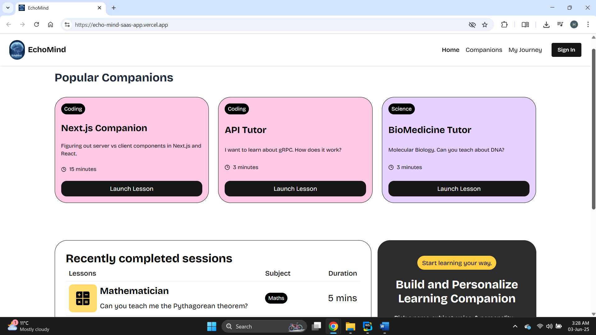

# EchoMind - A Next.js-Powered Learning Management System 🚀

## 📖 Overview
EchoMind is a cutting-edge Learning Management System (LMS) SaaS application built to deliver interactive, voice-driven educational experiences. Leveraging a robust tech stack—Next.js, Supabase, Clerk, Stripe, and Vapi—this project offers secure user authentication, subscription billing, and AI-powered voice agents for seamless learning sessions. Designed with scalability and developer experience in mind, EchoMind provides a modular codebase, modern UI/UX, and real-time backend capabilities. Whether you're a student, educator, or developer, EchoMind empowers you to learn, teach, and innovate. Join us in redefining online education! 🎓


**Figure 1: EchoMind SaaS Home page**


## 🌐 Live Demo
EchoMind is live and ready to explore! Check out the deployed app at:👉 https://echo-mind-saas-app.vercel.app/ 

Sign up, explore courses, and experience voice-driven learning with AI tutors in action.


## 🛠️ Tech Stack
**Next.js 15** : A React framework for server-side rendering, static site generation, and API routes, ensuring a fast and scalable full-stack application.

**Supabase**: An open-source Firebase alternative providing a PostgreSQL database, real-time subscriptions, and storage APIs.

**Clerk**: A unified platform for authentication, user management, and subscription billing with Stripe integration.

**Vapi**: A voice AI platform for creating low-latency, conversational AI agents with speech-to-text and text-to-speech capabilities.

**Stripe**: Handles secure payment processing for subscription plans.

**Tailwind CSS & shadcn/ui**: A utility-first CSS framework and component library for building a modern, responsive UI.

**TypeScript**: Adds static typing for better code quality and error detection.

**Zod**: A TypeScript-first schema validation library for ensuring data integrity.

**Sentry**: Provides error tracking and performance monitoring for debugging and optimization.


## ✨ Key Features
**AI Voice Agents**: Engage in interactive tutoring sessions with Vapi-powered AI voice agents tailored to your learning needs.

**Secure Authentication**: Clerk-based sign-up/sign-in with Google OAuth support for seamless user access.

**Subscription Management**: Flexible billing and subscription tiers managed via Clerk and processed through Stripe.

**Real-Time Database**: Supabase powers real-time data updates for session history, bookmarks, and user progress.

**Responsive Design**: A modern UI built with Tailwind CSS and shadcn/ui, ensuring cross-device compatibility.

**Search & Filters**: Quickly find tutors or sessions with robust search functionality.

**Code Reusability**: Modular components and architecture for efficient development and maintenance.

**Scalability**: Built with Next.js for production-ready performance and scalability.


**Figure 2: Companion AI tutor**

Experience an AI tutoring session with the API Tutor companion.


## 🛠️ Technical Implementation Details

### Supabase Integration

Supabase serves as the backbone for EchoMind’s backend, providing a PostgreSQL database, real-time subscriptions, and storage. Here’s how it’s implemented:

- **Database Schema**: Tables such as users, sessions, bookmarks, and tutors are defined in Supabase to store user data, session history, and tutor metadata. Row-Level Security (RLS) policies ensure users can only access their own data.
- **Real-Time Subscriptions**: Using Supabase’s real-time capabilities, EchoMind listens for updates to session data, enabling live updates for session history and user progress without manual refreshes.
- **Storage**: User-uploaded resources (e.g., study materials) are stored in Supabase Storage buckets, with access controlled via RLS policies.
- **API Integration**: Supabase’s auto-generated REST APIs are consumed in Next.js API routes to handle CRUD operations, ensuring a seamless data flow between the frontend and backend.


**Figure 2: Supabase ERD diagram**

The session_history and companions table structure in Supabase.

### Clerk Integration (Authentication & Billing)

Clerk powers EchoMind’s user management and billing workflows, providing a secure and developer-friendly solution:

- **Authentication**: Clerk’s prebuilt components (<SignIn /> and <SignUp />) are integrated into Next.js pages for user authentication. Google OAuth is enabled for social login, with Clerk handling token management and session persistence. The useUser hook provides access to user data across the app.
- **Using Junie for Clerk Authentication**: JetBrains’ AI coding agent, Junie, was used to streamline Clerk’s authentication setup. With a prompt like "Implement Clerk authentication with Google OAuth in my Next.js project," Junie automated the installation of @clerk/nextjs, configured environment variables, set up middleware for route protection, and integrated sign-up/sign-in components. It also generated tests to verify the authentication flow, ensuring seamless integration with EchoMind’s architecture.
- **Billing & Subscriptions**: Clerk’s subscription management integrates with Stripe to handle payments. Subscription plans are defined in Clerk’s dashboard, and the <PricingTable /> component is used to display plans and handle upgrades/downgrades. Webhooks from Clerk and Stripe are processed in Next.js API routes to sync subscription status with Supabase, ensuring access control based on user tiers.

### Vapi Integration

Vapi enables EchoMind’s voice-driven learning sessions with AI-powered tutors:

- **Voice Agents**: Vapi’s API is used to create conversational AI agents specializing in various subjects. The NEXT_PUBLIC_VAPI_WEB_TOKEN is used to authenticate API requests, and agents are configured with custom voices, languages, and conversational styles.
- **Real-Time Interaction**: Vapi’s low-latency speech-to-text and text-to-speech capabilities are integrated into the frontend using WebRTC, allowing users to interact with tutors via voice in real time.
- **Session Management**: Session data (e.g., conversation transcripts) is stored in Supabase, with Vapi’s API providing endpoints to start, stop, and manage sessions. The frontend uses React state to handle session lifecycle events.


## 🚀 Quick Start
Follow these steps to set up EchoMind locally on your machine.

## Prerequisites
Ensure you have the following installed:

- Git
- Node.js (v18 or later)
- npm (Node Package Manager)

## Cloning the Repository

git clone https://github.com/yourusername/echomind.git
cd echomind

## Installation

Install dependencies:
npm install

## Set Up Environment Variables
Create a .env file in the project root and add the following:

````
#Clerk
NEXT_PUBLIC_CLERK_PUBLISHABLE_KEY=your_clerk_publishable_key
CLERK_SECRET_KEY=your_clerk_secret_key
NEXT_PUBLIC_CLERK_SIGN_IN_URL=/sign-in
NEXT_PUBLIC_CLERK_SIGN_IN_FALLBACK_REDIRECT_URL=/
NEXT_PUBLIC_CLERK_SIGN_UP_FALLBACK_REDIRECT_URL=/

#Supabase
NEXT_PUBLIC_SUPABASE_URL=your_supabase_url
NEXT_PUBLIC_SUPABASE_ANON_KEY=your_supabase_anon_key

#Vapi
NEXT_PUBLIC_VAPI_WEB_TOKEN=your_vapi_web_token

#Sentry (optional)
SENTRY_AUTH_TOKEN=your_sentry_auth_token
````

Replace placeholders with your actual credentials from Supabase, Clerk, Vapi, and Sentry.

Running the Project
Start the development server:
````
npm run dev
````

Open http://localhost:3000 in your browser to explore EchoMind locally.


## 📢 Acknowledgments

Inspired by JavaScript Mastery’s SaaS App Tutorial.

Thanks to the open-source community for tools like Supabase, Clerk, and Vapi.


Built with 💻 by [Harishanan Thevarajah] Let’s redefine education together! 🚀
